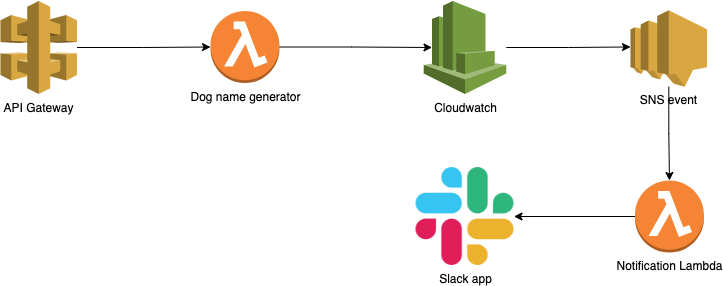

# Overview

This diagram explains how the whole project works.

API Gateway -> The main lambda -> Cloudwatch alarm ->  Amazon SNS Topic    ->  Notification Lambda -> Slack app

## 2XX
User --- SENDS REQUEST ----> LAMBDA --- Lambda validates the request and sends the result back -----> User

## 4XX, 5XX
[User] --- SENDS REQUEST ----> [LAMBDA] --- Lambda validates and throws an error -----> [Cloudwatch alarm] -- This alarm triggers an SNS event --> [AWS SNS] --> Notification Lambda -> SLACK
